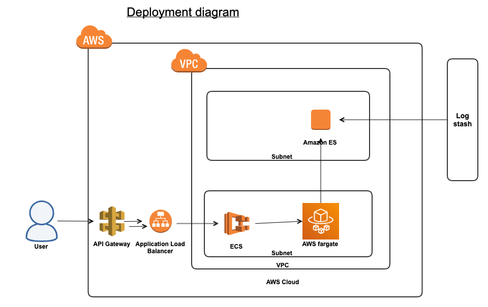
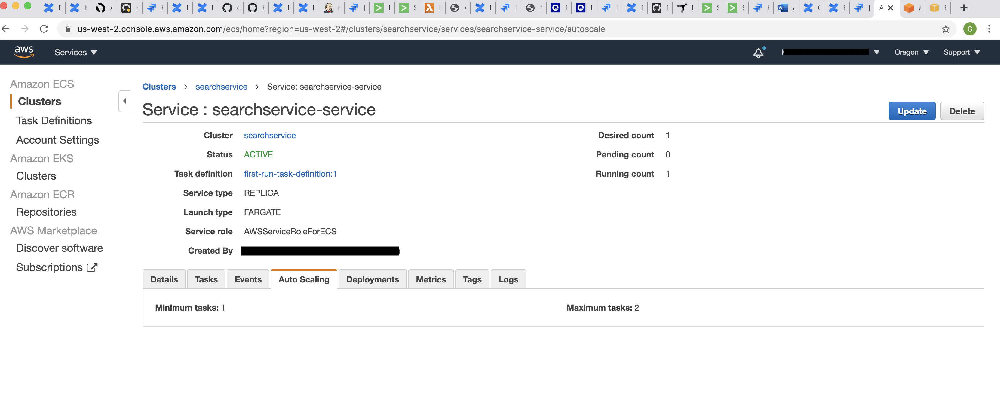
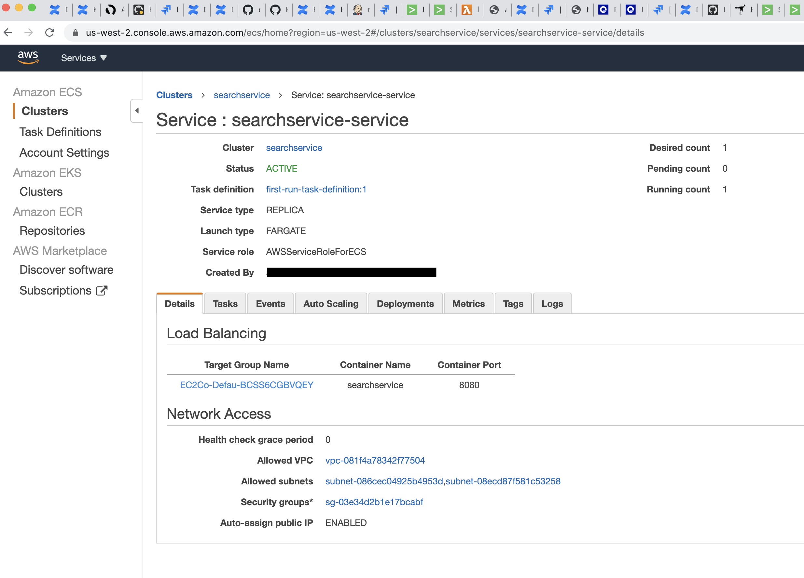
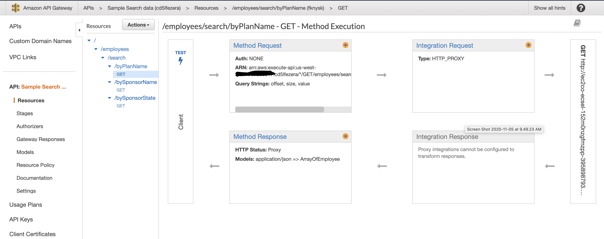

# search-service : 
A micro service that invokes AWS elastic search and make it available using API gateway
<BR>
## Tech stack
* Springboot 
* AWS elastic search
* Elastic Container Service 
* Logstash
* AWS API Gateway
    
# Run
Before run set environment variables for AWS role (i.e access key and secret)
    

This is a spring Boot Application so you can run it directly from your IDE by using 
*com.girishpore.searchservice.SearchServiceApplication* starter class. 


You may run also run Spring boot application from command line or by configuring your IDE to run the following following
mvn target:

    mvn spring-boot:run

for sample API
Once application is running open a browser and hit http://localhost:8080/swagger-ui.html# for swagger-ui 
Alternatively, you can also run application from Docker container:

    # build
    mvn clean install
    docker build -t searchservice .
    # run
    docker run -p 8080:8080 searchservice:latest


Open a browser and hit [http://LOCAL_DOCKER_IP:8080/](http://LOCAL_DOCKER_IP:8080/) 

Api request and responses
### 1. Search by Plan name
```
~ $ curl -X GET "http://ec2co-ecsel-152m0nzgfmzpp-395898793.us-west-2.elb.amazonaws.com:8080/employees/search/byPlanName?offset=0&size=1&value=BORO" -H "accept: application/json" | jq .
  % Total    % Received % Xferd  Average Speed   Time    Time     Time  Current
                                 Dload  Upload   Total   Spent    Left  Speed
100   195    0   195    0     0    711      0 --:--:-- --:--:-- --:--:--   711
[
  {
    "ein": "231997150",
    "planName": "BORO DEVELOPERS, INC. RETIREMENT PLAN",
    "sponsorName": "BORO DEVELOPERS, INC.",
    "sponsorState": "PA",
    "ackId": "20181011150916P030171114541001",
    "businessCode": "236200"
  }
]
```
### 2. Search by Sponsor name
```$xslt
~ $ curl -X GET "http://ec2co-ecsel-152m0nzgfmzpp-395898793.us-west-2.elb.amazonaws.com:8080/employees/search/bySponsorName?offset=1&size=2&value=BORO" -H "accept: application/json" | jq .
  % Total    % Received % Xferd  Average Speed   Time    Time     Time  Current
                                 Dload  Upload   Total   Spent    Left  Speed
100   438    0   438    0     0   1403      0 --:--:-- --:--:-- --:--:--  1403
[
  {
    "ein": "112699881",
    "planName": "BORO LAND SURVEYING P.C. RETIREMENT PLAN AND TRUST",
    "sponsorName": "BORO LAND SURVEYING P.C.",
    "sponsorState": "NY",
    "ackId": "20181206142040P030090315457001",
    "businessCode": "541370"
  },
  {
    "ein": "231919676",
    "planName": "TRI-BORO CONSTRUCTION SUPPLIES, INC. GROUP MEDICAL PLAN",
    "sponsorName": "TRI-BORO CONSTRUCTION SUPPLIES, INC.",
    "sponsorState": "PA",
    "ackId": "20180815130343P040003945465001",
    "businessCode": "423700"
  }
]
```

### 3. Search by Sponsor state
```$xslt
~ $ curl -X GET "http://ec2co-ecsel-152m0nzgfmzpp-395898793.us-west-2.elb.amazonaws.com:8080/employees/search/bySponsorState?offset=0&size=3&value=IL" -H "accept: application/json" | jq .
  % Total    % Received % Xferd  Average Speed   Time    Time     Time  Current
                                 Dload  Upload   Total   Spent    Left  Speed
100   630    0   630    0     0   2943      0 --:--:-- --:--:-- --:--:--  2943
[
  {
    "ein": "362762569",
    "planName": "CAPITOL WHOLESALE MEATS, INC. PROFIT SHARING AND RETIREMENT PLAN",
    "sponsorName": "CAPITOL WHOLESALE MEATS, INC.",
    "sponsorState": "IL",
    "ackId": "20180919134812P040129431469001",
    "businessCode": "311610"
  },
  {
    "ein": "364400687",
    "planName": "LENOX HEALTHCARE PROFIT SHARING 401(K) PLAN AND TRUST",
    "sponsorName": "JACK W. LENOX, LTD.",
    "sponsorState": "IL",
    "ackId": "20180919174006P030009321269001",
    "businessCode": "621111"
  },
  {
    "ein": "271067590",
    "planName": "ILLINOIS CORN PROCESSING 401(K) & PROFIT SHARING PLAN",
    "sponsorName": "ICP",
    "sponsorState": "IL",
    "ackId": "20180920124450P030008076025001",
    "businessCode": "312140"
  }
]
```

# Swagger 
   * Swagger url : http://ec2co-ecsel-152m0nzgfmzpp-395898793.us-west-2.elb.amazonaws.com:8080/swagger-ui.html
   * Api Docs Url : http://ec2co-ecsel-152m0nzgfmzpp-395898793.us-west-2.elb.amazonaws.com:8080/v2/api-docs
   
# Deployment Architecture


* Logstash is used to load data into elastic search
 
# Elastic Container Service

## Cluster details
Cluster enabled for autoscaling
 

## LoadBalancer 
Loadbalancer, VPC and Subnet configuration
 

## API Gateway 
API Gateway configuration
 

##  Improvements
- Parameter validation
- Automate the deployment using code templates for aws

## Logstash configuration
[Logstash config](logstsh/ebsa.txt)